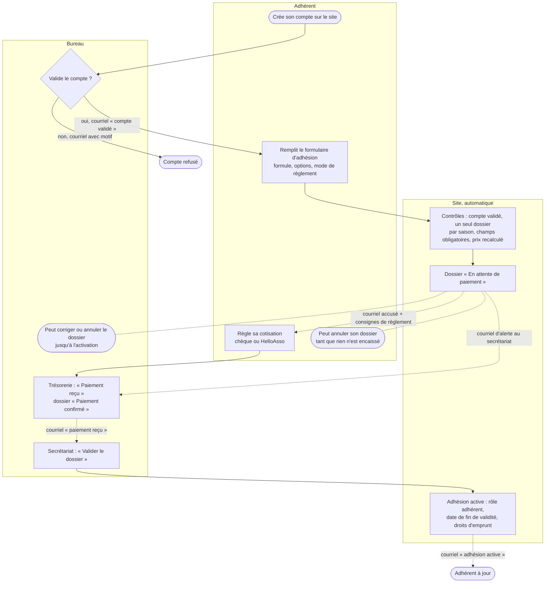

# Circuit d'une adhésion

Du compte créé sur le site à l'adhésion active : qui agit à chaque étape, et
quels courriels partent. Le code de référence est
`plugins/subalcatel-club/src/Membership/ApplicationService.php`.

## Qui fait quoi

| Étape | Qui agit | Statut du dossier | Courriel envoyé |
|---|---|---|---|
| 1. Validation du compte | Bureau, écran Comptes | — | À la personne : compte validé ou refusé (avec motif) |
| 2. Dépôt du dossier | Adhérent, page « Mon adhésion » | En attente de paiement | À l'adhérent : accusé et consignes de règlement. À l'adresse saisie sur la campagne : alerte de nouveau dossier |
| 3. Règlement | Adhérent, hors du site | inchangé | — |
| 4. Enregistrement du paiement | Bureau, droit trésorerie | Paiement confirmé | À l'adhérent : paiement reçu (réponse vers le trésorier) |
| 5. Validation finale | Bureau, droit secrétariat | Actif | À l'adhérent : adhésion active, avec la date de fin |

## À savoir

- **Trésorerie et secrétariat sont deux droits distincts**
  (`sub_validate_membership_treasury`, `sub_validate_membership_secretariat`),
  mais tout compte du bureau porte les deux. La fonction (trésorier,
  secrétaire) sert seulement à choisir à qui vont les réponses aux courriels.
- Le paiement est saisi à la main : le site ne voit ni les chèques ni HelloAsso.
- La validation finale n'est possible qu'une fois le paiement confirmé.
- Jusqu'à l'activation, le bureau peut **corriger** un dossier (formule,
  options, mode de règlement). Le prix est recalculé et l'adhérent est prévenu.
- **Annulation** : l'adhérent peut annuler lui-même tant que rien n'est
  encaissé ; le bureau peut annuler jusqu'à l'activation, et l'adhérent reçoit
  alors un courriel. Un dossier annulé reste consultable.
- Une fois actif, un dossier ne se modifie plus et ne s'annule plus.
- Un seul dossier par personne et par saison : pour corriger une saisie, on
  annule puis on redépose.
- Le statut « Refusé » existe (`ApplicationService::refuse()`), mais aucun
  écran ne l'appelle aujourd'hui : le bureau écarte un dossier en l'annulant.
